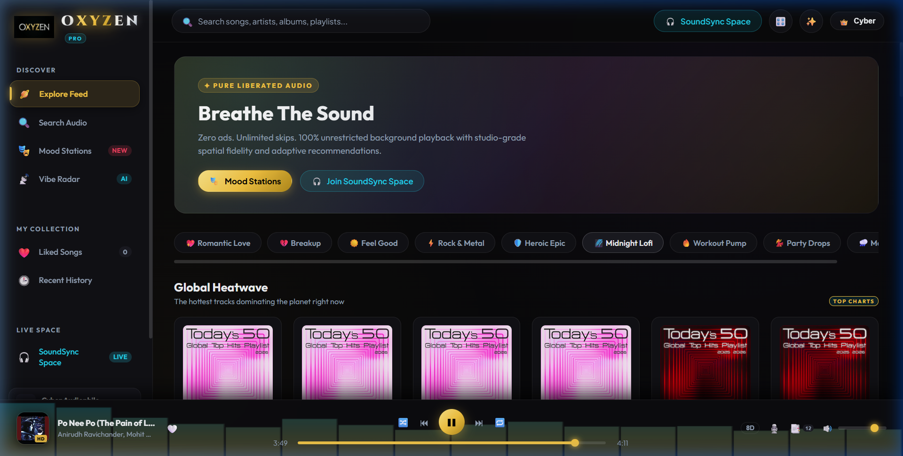
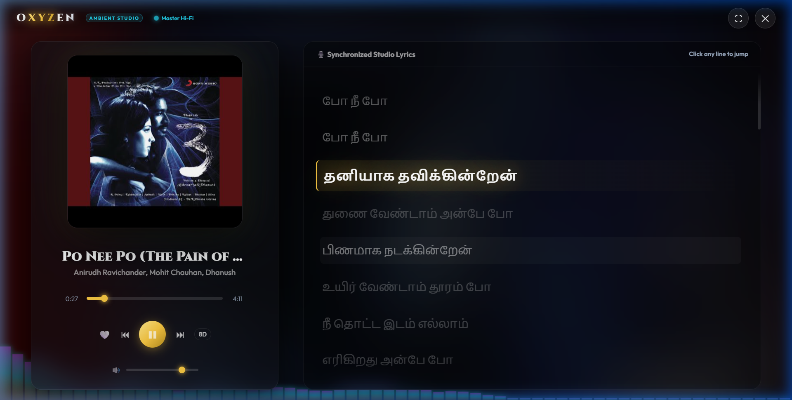
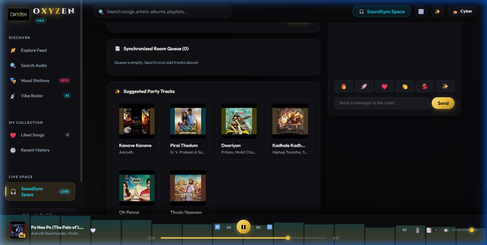
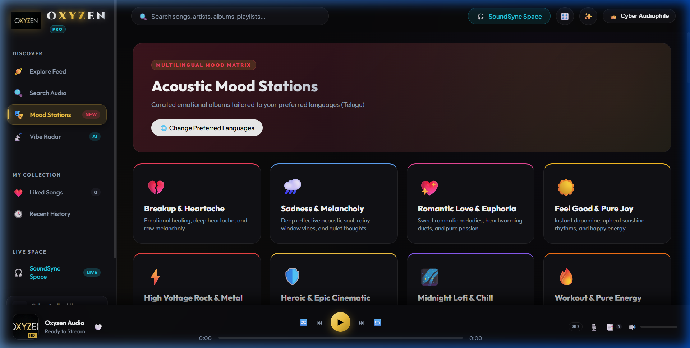
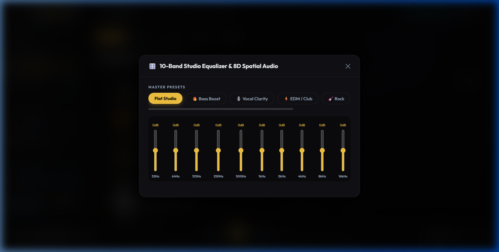
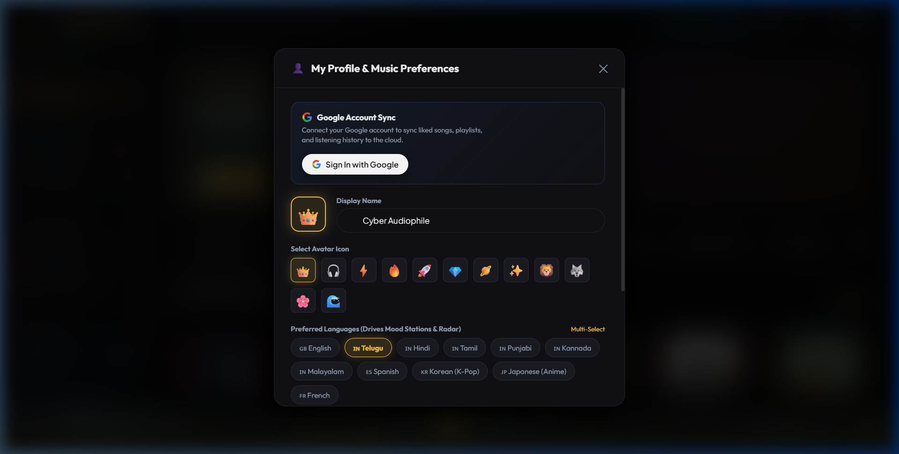

# ✦ OXYZEN — The Luxury Web Music & SoundSync Lounge

<div align="center">



[](https://fastapi.tiangolo.com)
[](https://www.python.org/)
[](https://developer.mozilla.org/en-US/docs/Web/API/Web_Audio_API)
[](https://render.com)
[](https://opensource.org/licenses/MIT)

**A state-of-the-art, high-fidelity web music streaming platform with 8D Binaural Spatial Audio, Apple Music Sing fluid lyrics, real-time SoundSync listening lounges, and multilingual mood matrix.**

[Key Features](#-key-features) • [Screenshots](#-screenshots-showcase) • [Architecture](#-architecture--tech-stack) • [Quickstart](#-quickstart-guide) • [Deploy on Render](#-deploying-on-render) • [License](#-license)

</div>

---

## 📸 Screenshots Showcase

### 🏠 1. Home Dashboard & Glassmorphic Audio Dock
High-contrast Obsidian & Gold design system with personalized playlists, trending releases, quick search, and bottom floating glass dock.
<div align="center">
  
</div>

---

### 🎙️ 2. Ambient Studio & 3D Vinyl Showcase
3D spinning vinyl record with grooved reflection highlights, living dynamic Aurora mesh background, and Apple Music Sing fluid lyrics with vertical auto-centering and click-to-seek jump points.
<div align="center">
  
</div>

---

### ⚡ 3. SoundSync Live Listening Lounge
Real-time synchronized music rooms powered by WebSockets. Host/admin instant queue controls, collaborative song requests, synced playback position, and live party chat.
<div align="center">
  
</div>

---

### 🎭 4. Multilingual Mood Stations Matrix
Curated emotional frequencies across 11+ languages (English, Telugu, Hindi, Tamil, Punjabi, Spanish, Korean, Japanese, and French).
<div align="center">
  
</div>

---

### 🎚️ 5. 10-Band Studio Equalizer & 8D Spatial Binaural Master
Studio-grade acoustic soundstage featuring a 10-band interactive frequency equalizer, 6 acoustic presets, and a 360° rotational binaural spatial panner.
<div align="center">
  
</div>

---

### 👤 6. Listener Sound Profile & Preferences
Personalized listening identity card, 12 tactile persona icons, multilingual preference matrix, and listening analytics dashboard.
<div align="center">
  
</div>

---

## ✨ Key Features

- **🎧 8D Spatial Binaural Surround**:
  Built on top of the native browser `Web Audio API` (`StereoPannerNode`, `PannerNode`, and `BiquadFilterNode`). Simulates dynamic spherical rotational movement of sound around the listener's head.
- **🎛️ 10-Band Studio Master Equalizer**:
  Fine-tune 32Hz, 64Hz, 125Hz, 250Hz, 500Hz, 1kHz, 2kHz, 4kHz, 8kHz, and 16kHz frequencies with presets for *Bass Boost*, *Vocal Clarity*, *Club Electronic*, *Acoustic*, *Rock*, and *Flat Master*.
- **🎙️ Ambient Studio (Apple Music Sing Style Fluid Lyrics)**:
  Real-time synchronized lyrics engine highlighting the active verse with warm golden typography, ambient Gaussian blur on upcoming/past verses, and instantaneous seek jumping on verse click.
- **⚡ SoundSync Real-Time Listening Lounges**:
  Listen to music together with friends in real-time. Sub-50ms synchronized audio playback, synchronized queue management with host play permissions, member song requests, and real-time room chat with reaction bursts.
- **🌐 Multilingual Mood Hub & Matrix**:
  Tailored mood stations (*Romantic Love*, *Late Night Lofi*, *High Voltage Workout*, *Deep Focus*, *Party Energy*, *Melancholy Blues*) personalized according to your selected languages.
- **📡 Vibe Radar Real-Time Recommendations**:
  Acoustic harmonic matching engine generating kindred recommendations as soon as a song plays.
- **🔒 Privacy-Focused Local & SQLite Architecture**:
  No third-party login trackers. All user favorites, play history, custom playlists, and listening preferences are stored in high-speed local storage and SQLite with WAL mode.

---

## 🛠️ Architecture & Tech Stack

```
oxyzen/
├── backend/
│   ├── server.py              # FastAPI application & WebSocket Hub
│   └── services/
│       ├── audio_service.py   # Audio streaming, metadata & lyrics extraction
│       ├── db_service.py      # SQLite WAL storage for likes, history & profiles
│       └── sync_service.py    # SoundSync real-time room & queue manager
├── static/
│   ├── index.html             # Single-page application markup
│   ├── css/
│   │   └── style.css          # Vanilla CSS Design System & Glassmorphism
│   ├── js/
│   │   ├── app.js             # Core UI state & interaction controller
│   │   ├── audio-engine.js    # Web Audio API 8D Spatial & Equalizer engine
│   │   └── sync-client.js     # SoundSync WebSocket client & audio clock sync
│   └── assets/                # Logos, icons & brand media
├── screenshots/               # High-resolution screenshots for documentation
├── Dockerfile                 # Container deployment definition
├── render.yaml                # Render Blueprint configuration
├── Procfile                   # Process file for web platforms
├── requirements.txt           # Python dependencies
└── run.py                     # Local launch script
```

---

## 🚀 Quickstart Guide

### Prerequisites
- Python 3.10 or higher
- Git

### 1. Clone the Repository
```bash
git clone https://github.com/your-username/oxyzen.git
cd oxyzen
```

### 2. Create and Activate Virtual Environment
```bash
# Windows
python -m venv .venv
.\.venv\Scripts\activate

# macOS / Linux
python3 -m venv .venv
source .venv/bin/activate
```

### 3. Install Dependencies
```bash
pip install -r requirements.txt
```

### 4. Launch Oxyzen
```bash
python run.py
```
*Or directly via Uvicorn:*
```bash
uvicorn backend.server:app --host 0.0.0.0 --port 8000 --reload
```

Open your browser and navigate to: **`http://localhost:8000`**

---

## ☁️ Deploying on Render

Oxyzen is pre-configured for zero-configuration one-click deployment on **Render**:

1. Fork or push this repository to your **GitHub / GitLab** account.
2. Go to your [Render Dashboard](https://dashboard.render.com/) and click **New +** → **Web Service**.
3. Connect your repository.
4. Set the following configuration:
   - **Environment**: `Python` (or `Docker`)
   - **Build Command**: `pip install -r requirements.txt`
   - **Start Command**: `uvicorn backend.server:app --host 0.0.0.0 --port $PORT`
5. Click **Deploy Web Service**.

> **Note:** WebSocket support and SSL are enabled automatically by Render.

---

## ⌨️ Keyboard Shortcuts

| Key | Action |
| :--- | :--- |
| <kbd>Space</kbd> | Toggle Play / Pause |
| <kbd>←</kbd> | Previous Track |
| <kbd>→</kbd> | Next Track |
| <kbd>M</kbd> | Mute / Unmute Volume |
| <kbd>F</kbd> | Toggle Ambient Cinema Fullscreen |
| <kbd>Esc</kbd> | Exit Ambient Studio / Close Open Modals |

---

## 📄 License

This project is licensed under the **MIT License** — see the [LICENSE](LICENSE) file for details.

---

<div align="center">
  <sub>Crafted with passion for pure, unchained acoustic excellence. ✦ <b>OXYZEN</b></sub>
</div>
